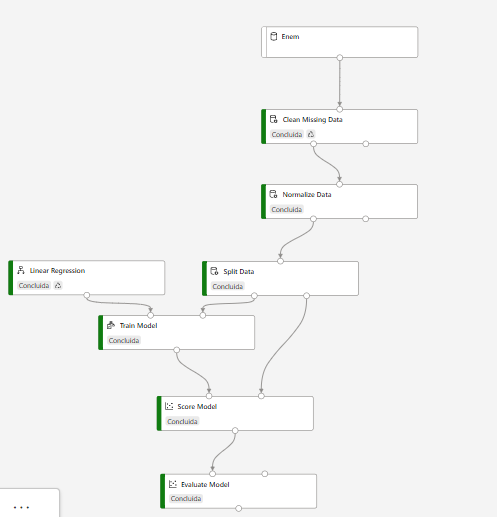
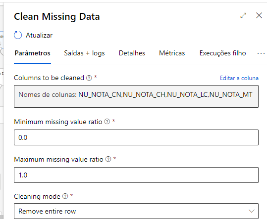
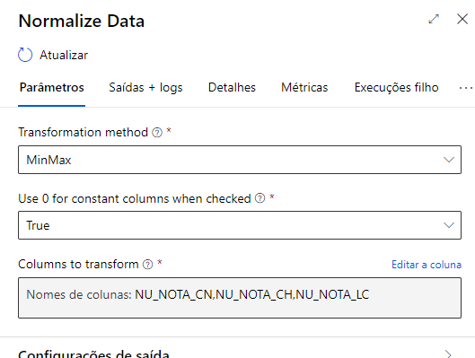
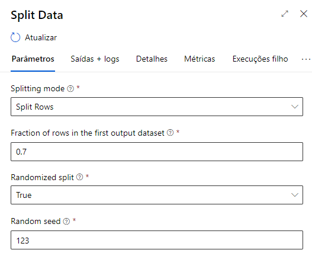
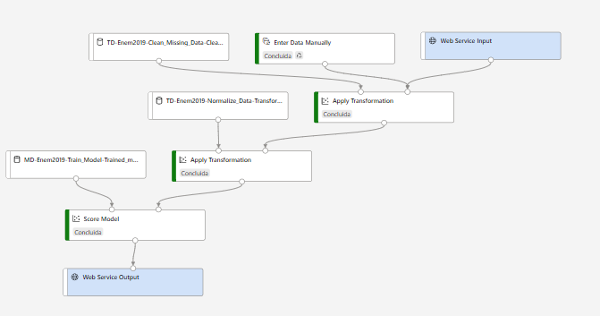
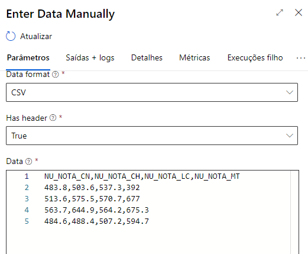
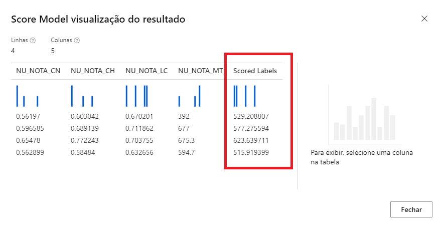

# Desafio1

Passo a passo
- Criei um conjunto de dados no Machine Learning do Azure e fiz um upload dos microdados do Enem 2019

- Selecionei apenas as colunas NU_NOTA_CN, NU_NOTA_CH, NU_NOTA_LC e NU_NOTA_MT,

- Criei uma instância de computação e um cluster de cálculo com a configuração Standard_D11_v2 e o tipo de máquina virtual sendo CPU

- Criei um pipeline de teste:

Nele, eu configurei o clean data desse modo:

O normalize data desse modo:

E o Split data assim:

- depois criei um pipeline de inferencia:

- pus esses dados para testar:

- e esse foi o resultado do teste:

